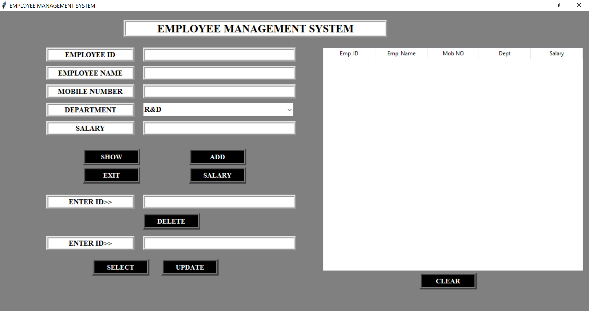
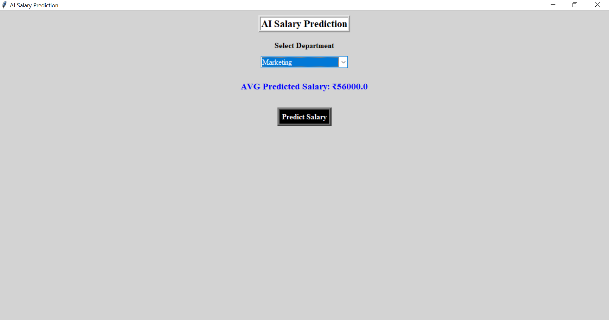

# Employee Management System

A **GUI-based Employee Management System** developed in **Python** using **Tkinter** for the interface and **MySQL (pymysql)** as the database backend. This system allows users to **add, update, delete, view employee records, and check employee salary** in an intuitive graphical interface.

---

## Features

- **Add Employee**: Insert new employee records with ID, name, mobile number, department, and salary.
- **View Employee**: Display all employee records in a table format using `Treeview`.
- **Update Employee**: Update details of an existing employee by selecting their ID.
- **Delete Employee**: Remove employee records from the database using employee ID.
- **Salary Management**: Check salary of a specific employee by entering their ID.
- **Clear Table**: Remove all displayed data from the table for better readability.

---

## Tools & Technologies Used

- **Python 3.x**
- **Tkinter** – GUI framework for Python
- **pymysql** – Python library to connect with MySQL database
- **MySQL** – Database management system
- **ttk.Treeview** – For displaying employee records in table format

---

## Database Setup

1. Install **MySQL** and create a database:
    ```sql
    CREATE DATABASE emp_db;
    USE emp_db;
    ```

2. Create the `emp` table:
    ```sql
    CREATE TABLE emp (
    emp_id VARCHAR(10) PRIMARY KEY,
    emp_name VARCHAR(100),
    mob_no VARCHAR(15),
    dept VARCHAR(50),
    emp_salary VARCHAR(20)
)

    ```

---

## Installation & Setup

1. Clone the repository:
    ```bash
    git clone https://github.com/surajkale99/emp_project.git
    ```

2. Navigate to the project directory:
    ```bash
    cd employee-management-system
    ```

3. Install required Python libraries:
    ```bash
    pip install pymysql
    ```

4. Update **database credentials** in `app.py` if needed:
    ```python
    conn = pymysql.connect(user='root', host='localhost', password='Python@123', database='emp_db')
    ```

---

## Usage

1. Run the application:
    ```bash
    python app.py
    ```

2. The main window allows you to:
    - Add a new employee
    - View all employees
    - Delete an employee
    - Update employee details
    - Check an employee’s salary

3. Use the **CLEAR** button to remove all entries displayed in the table.

---


## Screenshots

### Main Window


### Salary Window


---

## Contribution

Feel free to fork this repository and contribute.  
- Bug reports, suggestions, and improvements are welcome.

---

## License

This project is **open source** and available under the MIT License.


